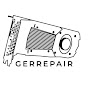

<p align="center">
  
</p>

<h1 align="center">GerRepair SPD RAW Dumper DDR4</h1>

<p align="center">
  Read, backup, edit and write DDR4 SPD EEPROM data on Windows.
</p>

<p align="center">
  
  
  
  
</p>

---

## ⚠️ Alpha Warning

This project is currently an **alpha version**.

The tool accesses low-level SMBus / SPD EEPROM functions. Incorrect usage can cause read errors, system instability or invalid SPD data.

### ⚠️ SPD Write Warning

This release includes **experimental SPD write support**.

Writing an invalid or corrupted `.bin` file to the RAM SPD EEPROM can make the RAM module unusable. In a worst-case scenario, the EEPROM has to be restored with an external hardware flasher.

**Use this tool at your own risk.**

---

## Features

- Read raw DDR4 SPD EEPROM data
- Save complete SPD dumps as `.bin` files
- Decode basic DDR4 SPD information
- Detect module type, capacity, speed, part number and manufacturer data where available
- Backup SPD data before writing
- Write a 512-byte DDR4 SPD `.bin` file back to the EEPROM
- Verify written data after the write operation
- GUI for easier usage
- Optional XMP editing workflow with separate OC tool
- Designed for Windows x64 systems

---

## What this tool is for

GerRepair SPD RAW Dumper is intended for:

- backing up DDR4 SPD EEPROM data
- checking and saving RAM SPD dumps
- restoring a known-good SPD backup
- experimenting with DDR4 SPD / XMP data in a controlled environment

It is **not** a stability tester and it does **not** guarantee that edited XMP or SPD data will boot on your system.

---

## Requirements

- Windows 10 / Windows 11, 64-bit recommended
- Administrator rights
- DDR4 memory modules
- Compatible SMBus access driver, for example `InpOutx64.dll`
- Close other SMBus tools before use, for example:
  - HWiNFO
  - CPU-Z sensor window
  - Ryzen Master
  - ZenTimings
  - OpenRGB
  - Mainboard RGB / monitoring tools

---

## Download

The latest alpha build can be downloaded from the GitHub Releases page:

[https://github.com/GerRepair/SPD_Dumper_DDR4/releases](https://github.com/GerRepair/SPD_Dumper_DDR4/releases)

---

## Basic Usage

1. Download the latest release ZIP.
2. Extract the ZIP file.
3. Start the program as **Administrator**.
4. Select the output folder.
5. Click **Scan & Dump**.
6. Save the generated `.bin` backup files in a safe place.

---

## Writing SPD Data

Before writing, the program will create a backup dump of the current SPD EEPROM data.

Recommended workflow:

1. Read and save the original SPD dump.
2. Keep at least one untouched backup copy.
3. Select the target DIMM address, for example `0x50` or `0x51`.
4. Select the `.bin` file to write.
5. Confirm the warning dialog.
6. Let the tool create a backup.
7. Wait for write and verify to finish.
8. Reboot and test carefully.

### Important

Only write SPD data if you know what you are doing. If the module does not boot after writing bad data, you may need an external EEPROM programmer / hardware flasher to recover it.

---

## XMP Editing

A separate XMP OC tool can be used to adjust XMP profile values in a saved SPD `.bin` file.

The recommended workflow is:

1. Dump SPD with this tool.
2. Open the dump in the XMP OC tool.
3. Make small and reasonable changes.
4. Save as a new patched `.bin` file.
5. Write the patched `.bin` only after keeping a safe backup.

Do not jump from a low-speed profile to unrealistic high-speed values. A DDR4-2400 module will usually not run with aggressive DDR4-3600 values.

---

## Building from Source

Install Python 3 on the build machine and run:

```bat
build_exe_GerRepair.bat
```

The compiled executable will be created in the `dist` folder.

For normal users, using the prebuilt release ZIP is recommended.

---

## Project Structure

```text
SPD_Dumper_DDR4/
├─ SPD_Read_GerRepair_Alpha.py
├─ build_exe_GerRepair.bat
├─ GerRepair_logo.png
├─ GerRepair_icon.ico
├─ licenses/
│  └─ LICENSE-InpOutx64.txt
├─ LICENSE
└─ README.md
```

---

## Safety Notes

- Always create a backup before writing.
- Never write random SPD files from the internet.
- Do not write SPD data made for a different RAM module unless you fully understand the differences.
- Close monitoring and RGB software before reading or writing.
- Use a UPS or stable power when writing EEPROM data.
- Keep a hardware flasher available if you plan to experiment heavily.

---

## Known Limitations

- Alpha software, bugs are expected.
- Focused on DDR4 SPD EEPROMs.
- DDR5 SPD hubs are not the primary target.
- Some AMD systems may require special SMBus access handling.
- Some systems may block low-level drivers.
- XMP edits do not guarantee memory stability.

---

## Third-Party Components

This project may use `InpOutx64.dll` for low-level port access.

See:

```text
licenses/LICENSE-InpOutx64.txt
```

---

## License

This project is released under the MIT License.

See:

```text
LICENSE
```

---

## Author

Created by **GerRepair**.

GitHub: [https://github.com/GerRepair](https://github.com/GerRepair)

Project: [https://github.com/GerRepair/SPD_Dumper_DDR4](https://github.com/GerRepair/SPD_Dumper_DDR4)
